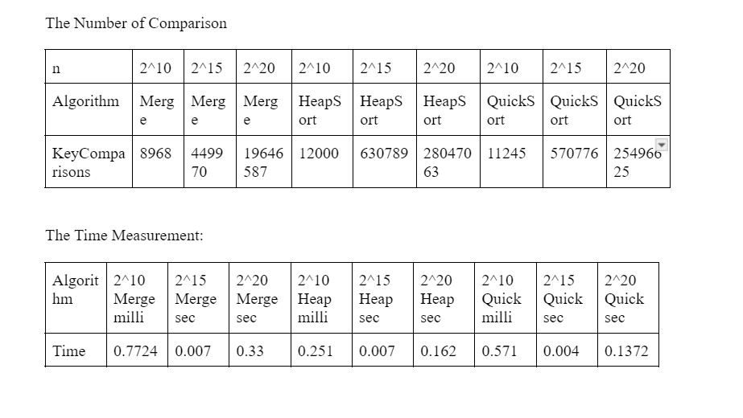

# Java-Data-Structures-Algorithms

## [Insertion Sort](InsertionSort.java) 
- This Java program exemplifies the insertion sort algorithm through a series of test cases
- N = 32
  - Worst Case
  - Best Case
  - Average Case
- N = 100
  - Average Case
- N = 1000
  - Average Case
- N = 1000
  - Average Case
 
- The code generates input arrays in ascending, descending, and random orders, providing insightful metrics such as global and comparison counts for each case. This repository serves as a valuable resource for understanding and analyzing the performance of insertion sort under different scenarios, fostering a deeper comprehension of algorithmic complexities in sorting.

- Be advised that the printing statement for the array with 10000 values is commented. To see it values, make sure your pc is built for this runtime and uncomment it with caution.

## [MergeSort - HeapSort- QuickSort](MergeSort_HeapSort_QuickSort.java) 
- This Java program exemplifies the Merge Sort - HeapSort- QuickSort algorithm through a series of test cases
- N = 32
  - Worst Case
  - Best Case
  - Average Case
- N = 100
  - Average Case
- N = 1000
  - Average Case
- N = 1000
  - Average Case
- I tracked the 
  - Number of comparisons in each algorithm
  - Time it took to compile

## Calculations

